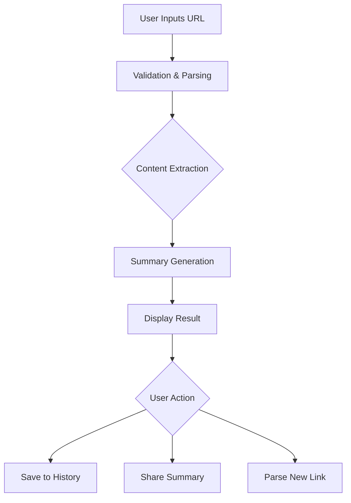

## 1. Product Overview
分享链接自动解析总结服务是一个工具类应用，用户输入任意分享链接后，系统自动解析内容并生成简洁总结。
- 解决用户快速获取链接内容核心信息的问题，节省阅读时间
- 目标用户为需要高效处理信息的职场人士、学生和内容创作者

## 2. Core Features

### 2.1 User Roles
| Role | Registration Method | Core Permissions |
|------|---------------------|------------------|
| Guest User | No registration required | Use basic link parsing and summarization |
| Registered User | Email registration | Use advanced features, save history, customize settings |

### 2.2 Feature Module
1. **Home page**: link input area, parsing status, summary display, history list
2. **User Dashboard**: saved summaries, personal settings, API key management
3. **API Documentation**: usage guide, rate limits, code examples

### 2.3 Page Details
| Page Name | Module Name | Feature description |
|-----------|-------------|---------------------|
| Home page | Link Input Area | Text field for entering URLs, parse button, recent links dropdown |
| Home page | Parsing Status | Loading animation, progress indicator, error messages |
| Home page | Summary Display | Clean summary output, original link preview, share options |
| Home page | History List | Recent parsing history, quick access to past summaries |
| User Dashboard | Saved Summaries | List of saved summaries, search and filter options |
| User Dashboard | Personal Settings | Theme preference, default summary length, notification settings |
| User Dashboard | API Key Management | Generate and revoke API keys, usage statistics |
| API Documentation | Usage Guide | Endpoint descriptions, request/response examples |
| API Documentation | Rate Limits | Free vs paid tier limits, pricing information |
| API Documentation | Code Examples | Sample code in various programming languages |

## 3. Core Process
User inputs a URL → System validates and parses the link → Extracts content → Generates summary → Displays result to user → Optionally saves to history

## 4. User Interface Design
### 4.1 Design Style
- Primary color: #3b82f6 (blue)
- Secondary color: #10b981 (green)
- Accent color: #f59e0b (amber)
- Button style: Rounded corners (8px), subtle shadow
- Font: Inter (sans-serif), 16px base size
- Layout style: Clean card-based design with ample white space
- Icon style: Minimalist, line-based icons

### 4.2 Page Design Overview
| Page Name | Module Name | UI Elements |
|-----------|-------------|-------------|
| Home page | Link Input Area | Large text field with placeholder, prominent parse button, recent links dropdown |
| Home page | Parsing Status | Skeleton loader, progress bar, error alerts with retry option |
| Home page | Summary Display | Card with title, summary text, original link preview, share buttons |
| Home page | History List | Collapsible sidebar with recent items, timestamp, and quick access |
| User Dashboard | Saved Summaries | Table view with search bar, filter options, pagination |
| User Dashboard | Personal Settings | Toggle switches, dropdown menus, color picker for theme |
| User Dashboard | API Key Management | Key generation form, usage stats chart, revoke button |
| API Documentation | Usage Guide | Tabs for different endpoints, code blocks with syntax highlighting |
| API Documentation | Rate Limits | Comparison table, pricing cards |
| API Documentation | Code Examples | Tabbed interface for different languages, copy buttons |

### 4.3 Responsiveness
- Desktop-first design with mobile adaptation
- Mobile view: stacked layout, collapsible sections
- Touch optimization: larger buttons, swipe gestures for history
- Breakpoints: 1200px (desktop), 768px (tablet), 480px (mobile)

### 4.4 3D Scene Guidance
Not applicable for this project