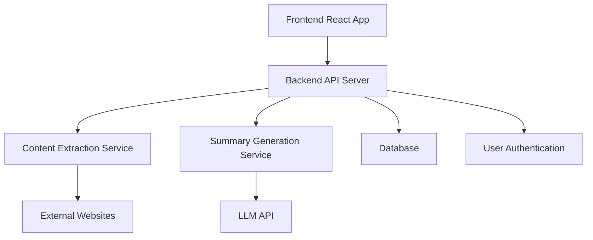
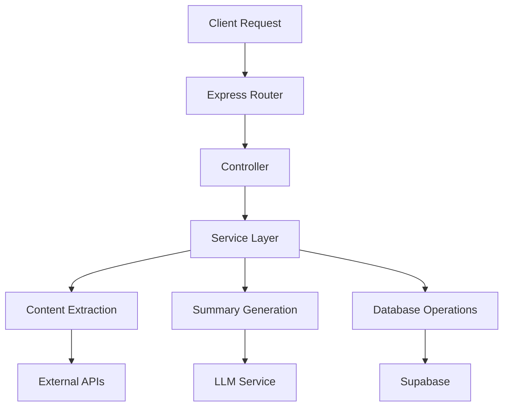
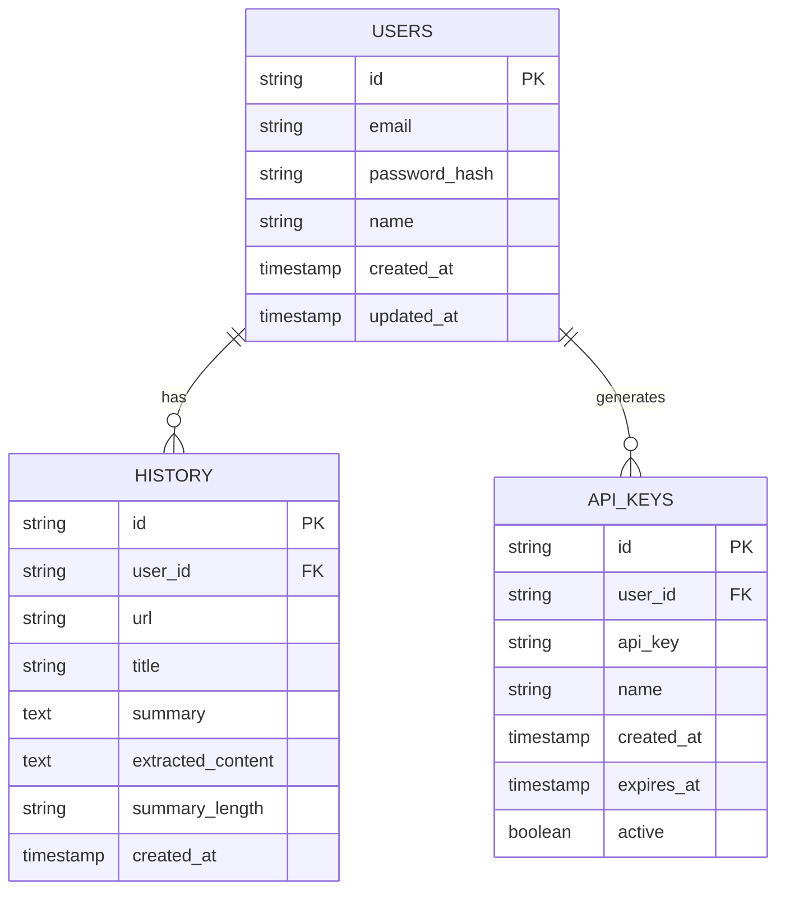

## 1. Architecture Design


## 2. Technology Description
- Frontend: React@18 + TypeScript + Tailwind CSS + Vite
- Initialization Tool: vite-init
- Backend: Express@4 + TypeScript
- Database: PostgreSQL (Supabase)
- Authentication: Supabase Auth
- Content Extraction: cheerio + axios
- Summary Generation: OpenAI API (or alternative LLM)
- Deployment: Vercel (frontend) + Render (backend)

## 3. Route Definitions
| Route | Purpose |
|-------|---------|
| / | Home page with link input and summary display |
| /dashboard | User dashboard with saved summaries and settings |
| /api | API documentation page |
| /login | User login page |
| /register | User registration page |

## 4. API Definitions

### 4.1 Backend API Endpoints

#### POST /api/parse
- **Purpose**: Parse and summarize a URL
- **Request Body**:
  ```typescript
  interface ParseRequest {
    url: string;
    summaryLength?: 'short' | 'medium' | 'long';
  }
  ```
- **Response**:
  ```typescript
  interface ParseResponse {
    success: boolean;
    data?: {
      title: string;
      summary: string;
      originalUrl: string;
      extractedContent: string;
      timestamp: string;
    };
    error?: string;
  }
  ```

#### GET /api/history
- **Purpose**: Get user's parsing history
- **Response**:
  ```typescript
  interface HistoryResponse {
    success: boolean;
    data?: Array<{
      id: string;
      url: string;
      title: string;
      summary: string;
      timestamp: string;
    }>;
    error?: string;
  }
  ```

#### POST /api/history/save
- **Purpose**: Save a summary to user's history
- **Request Body**:
  ```typescript
  interface SaveHistoryRequest {
    url: string;
    title: string;
    summary: string;
  }
  ```
- **Response**:
  ```typescript
  interface SaveHistoryResponse {
    success: boolean;
    data?: {
      id: string;
    };
    error?: string;
  }
  ```

#### POST /api/api-key/generate
- **Purpose**: Generate API key for user
- **Response**:
  ```typescript
  interface GenerateApiKeyResponse {
    success: boolean;
    data?: {
      apiKey: string;
    };
    error?: string;
  }
  ```

## 5. Server Architecture Diagram


## 6. Data Model

### 6.1 Data Model Definition


### 6.2 Data Definition Language

```sql
-- Create users table
CREATE TABLE users (
  id UUID PRIMARY KEY DEFAULT gen_random_uuid(),
  email VARCHAR(255) UNIQUE NOT NULL,
  password_hash VARCHAR(255) NOT NULL,
  name VARCHAR(255),
  created_at TIMESTAMP DEFAULT NOW(),
  updated_at TIMESTAMP DEFAULT NOW()
);

-- Create history table
CREATE TABLE history (
  id UUID PRIMARY KEY DEFAULT gen_random_uuid(),
  user_id UUID REFERENCES users(id),
  url VARCHAR(2048) NOT NULL,
  title VARCHAR(255),
  summary TEXT,
  extracted_content TEXT,
  summary_length VARCHAR(10) DEFAULT 'medium',
  created_at TIMESTAMP DEFAULT NOW()
);

-- Create api_keys table
CREATE TABLE api_keys (
  id UUID PRIMARY KEY DEFAULT gen_random_uuid(),
  user_id UUID REFERENCES users(id),
  api_key VARCHAR(255) UNIQUE NOT NULL,
  name VARCHAR(255),
  created_at TIMESTAMP DEFAULT NOW(),
  expires_at TIMESTAMP,
  active BOOLEAN DEFAULT true
);

-- Create indexes
CREATE INDEX idx_history_user_id ON history(user_id);
CREATE INDEX idx_history_created_at ON history(created_at);
CREATE INDEX idx_api_keys_user_id ON api_keys(user_id);
CREATE INDEX idx_api_keys_api_key ON api_keys(api_key);

-- Grant permissions
GRANT SELECT ON users TO anon;
GRANT SELECT, INSERT, UPDATE, DELETE ON history TO authenticated;
GRANT SELECT, INSERT, UPDATE, DELETE ON api_keys TO authenticated;
```