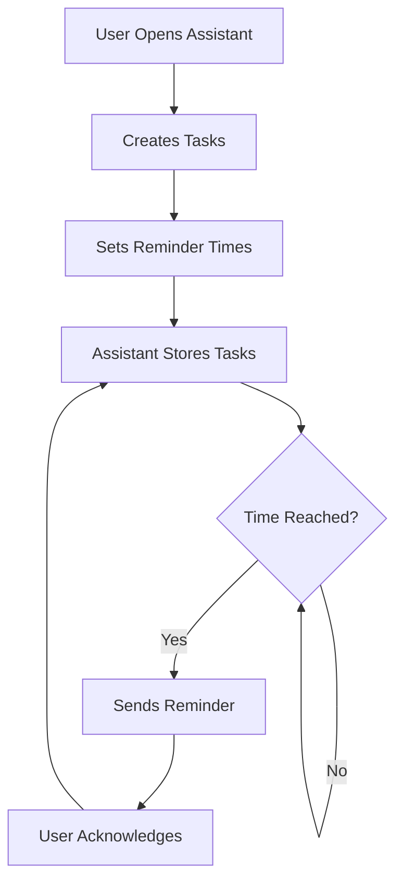

## 1. Product Overview
桌面小助手是一个悬浮式桌面应用，用户可以与它交流发送每日规划，小助手会定时提醒用户开始某项任务。
- 解决用户时间管理和任务提醒的问题，提高工作效率
- 目标用户为需要良好时间管理的职场人士、学生和自由职业者

## 2. Core Features

### 2.1 User Roles
| Role | Registration Method | Core Permissions |
|------|---------------------|------------------|
| User | No registration required | Use all features, create and manage tasks |

### 2.2 Feature Module
1. **悬浮界面**: 常驻桌面，可拖拽移动，点击展开/收起
2. **任务管理**: 创建、编辑、删除任务，设置提醒时间
3. **智能交互**: 文本输入交流，发送每日规划，接收任务提醒
4. **提醒系统**: 定时提醒，弹出通知，声音提醒

### 2.3 Page Details
| Page Name | Module Name | Feature description |
|-----------|-------------|---------------------|
| 悬浮界面 | 主界面 | 显示小助手图标，可拖拽移动，点击展开聊天窗口 |
| 悬浮界面 | 聊天窗口 | 文本输入框，消息历史，发送按钮，任务列表 |
| 任务管理 | 任务创建 | 任务名称，时间设置，优先级，重复选项 |
| 任务管理 | 任务列表 | 显示所有任务，状态标记，编辑/删除功能 |
| 提醒系统 | 提醒通知 | 弹出窗口，声音提醒，任务详情显示 |

## 3. Core Process
User interacts with assistant → Creates tasks with timestamps → Assistant stores tasks → Assistant reminds user at specified times

## 4. User Interface Design
### 4.1 Design Style
- Primary color: #4f46e5 (indigo)
- Secondary color: #10b981 (green)
- Accent color: #f59e0b (amber)
- Button style: Rounded corners (12px), subtle shadow
- Font: Inter (sans-serif), 14px base size
- Layout style: Compact floating window with rounded corners
- Icon style: Minimalist, friendly, cartoon-style

### 4.2 Page Design Overview
| Page Name | Module Name | UI Elements |
|-----------|-------------|-------------|
| 悬浮界面 | 主界面 | Small circular icon with animation, draggable, click to expand |
| 悬浮界面 | 聊天窗口 | Text input field, send button, message bubbles, task list sidebar |
| 任务管理 | 任务创建 | Modal dialog with form fields, time picker, priority selector |
| 任务管理 | 任务列表 | Compact list with checkboxes, due times, priority indicators |
| 提醒系统 | 提醒通知 | Popup window with task details, snooze button, complete button |

### 4.3 Responsiveness
- Desktop-only application
- Adjustable window size
- Draggable interface
- Always-on-top option

### 4.4 3D Scene Guidance
Not applicable for this project