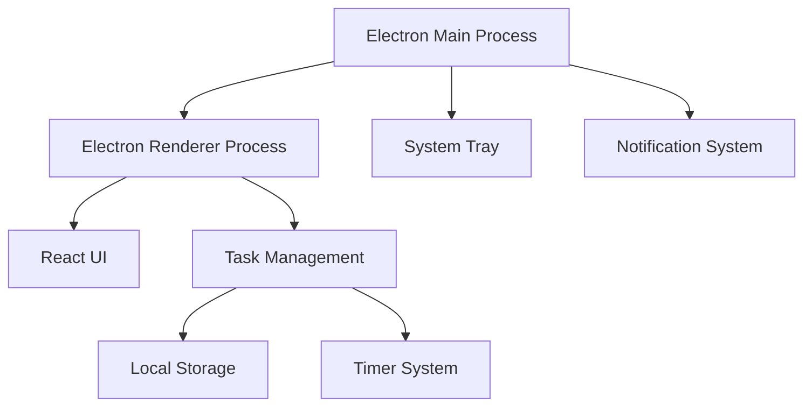
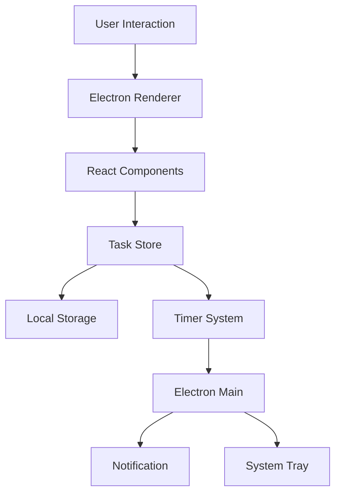
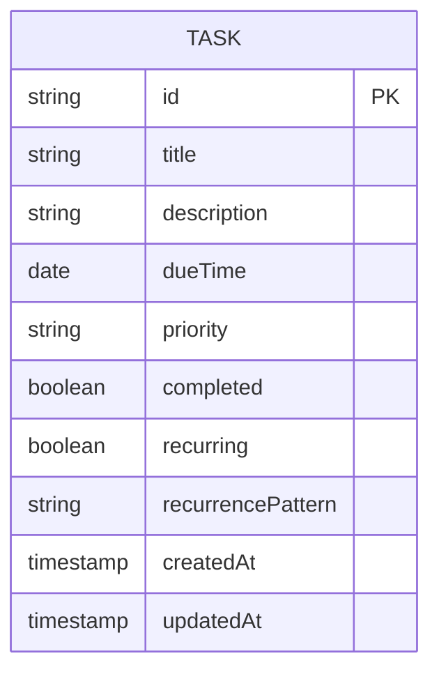

## 1. Architecture Design


## 2. Technology Description
- Framework: Electron@20.0.0 + React@18 + TypeScript
- UI Framework: React@18 + Tailwind CSS
- State Management: Zustand
- Storage: Electron localStorage
- Notification: Electron Notification API
- Build Tool: Vite
- Packaging: Electron-builder

## 3. Route Definitions
| Route | Purpose |
|-------|---------|
| / | Main chat interface |
| /tasks | Task management interface |
| /settings | Settings interface |

## 4. API Definitions

### 4.1 Internal API

#### Task Management API
- **addTask(task: Task)**: Add a new task
- **updateTask(id: string, task: Partial<Task>)**: Update an existing task
- **deleteTask(id: string)**: Delete a task
- **getTasks()**: Get all tasks
- **getTaskById(id: string)**: Get a task by ID

#### Reminder API
- **setReminder(taskId: string, time: Date)**: Set a reminder for a task
- **cancelReminder(taskId: string)**: Cancel a reminder
- **snoozeReminder(taskId: string, minutes: number)**: Snooze a reminder

## 5. Server Architecture Diagram


## 6. Data Model

### 6.1 Data Model Definition


### 6.2 Data Definition

```typescript
interface Task {
  id: string
  title: string
  description: string
  dueTime: Date
  priority: 'low' | 'medium' | 'high'
  completed: boolean
  recurring: boolean
  recurrencePattern: string // cron expression
  createdAt: Date
  updatedAt: Date
}

interface Reminder {
  taskId: string
  time: Date
  timeoutId: NodeJS.Timeout
}
```